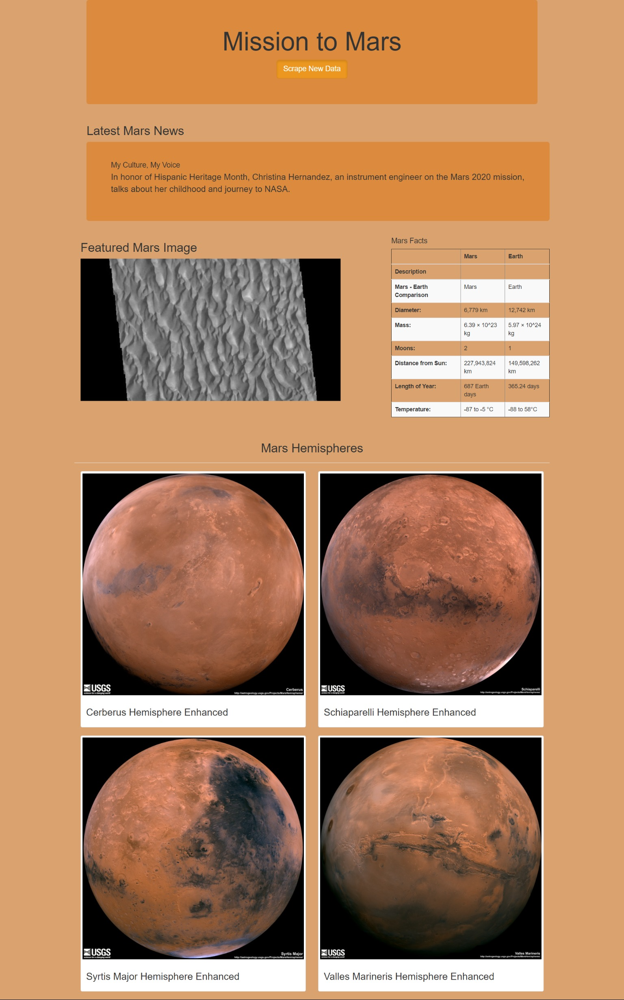

# Mission to Mars
Module 10

## Overview of the project:
The purpose of this project was to help Robin, who’s dreaming of a NASA job, creating a stunning webpage to shows her interest in space and get noticed. 

## Results:
•	In this project, we used `Flask` to create an application which scrapes websites, saved the results, and used it to build a webpage. `Splinter` and `BeautifulSoup` imports were used to scrape and collect information such as news and pictures at the click of a button. The collected data was saved in `Mongo Database` using `Flask_PyMongo` module and referenced in html code. The final webpage is responsive to screen size and look as below:

